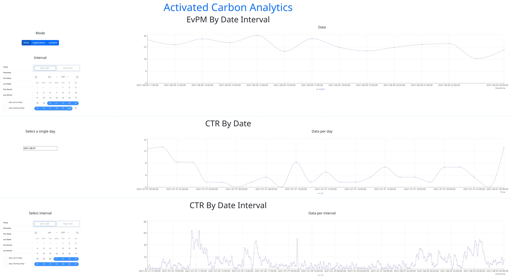

# Activated Carbon Analytics


## Overview


## Requirements

- Node.js 20
- Typescript 5
- Docker 24 / Docker Compose

## How to launch

Preparation:
1. Run clickhouse
```bash
docker-compose -f docker-compose.clickhouse.yml up
```
2. Create Clickhouse database (in DataGrip for example)
```sql
CREATE DATABASE IF NOT EXISTS activated_carbon_analytics;
USE activated_carbon_analytics;
```
3. Create tables (in DataGrip for example)
```sql
CREATE TABLE IF NOT EXISTS x_table
(
    reg_time DateTime,
    uid String,
    fc_imp_chk Int8,
    fc_time_chk Int16,
    utmtr Int8,
    mm_dma Int16,
    osName String,
    model String,
    hardware String,
    site_id String
)
ENGINE = MergeTree()
ORDER BY reg_time;

CREATE TABLE IF NOT EXISTS y_table
(
    uid String,
    tag String
)
ENGINE = MergeTree()
ORDER BY uid;
```
4. Copy `x.csv` and `y.csv` to the project root dir and import csv-files to Clickhouse database
```bash

# Copy csv-files to the Clickhouse data mapped dir
cp ~/somewhere/x.csv .
cp ~/somewhere/y.csv .


# Populate Clickhouse database with x and y data (e.g. in Docker Desktop terminal)
cd /var/lib/clickhouse
clickhouse-client --query="INSERT INTO x_table FORMAT CSVWithNames" --database=activated_carbon_analytics < x.csv

clickhouse-client --query="INSERT INTO y_table FORMAT CSVWithNames" --database=activated_carbon_analytics < y.csv
```

5. Process x_table and y_table, create utility tables/views
```sql
-- Summary view for x_table
CREATE OR REPLACE VIEW x_table_summary_view AS
SELECT
    toStartOfMinute(x_table.reg_time) AS reg_time,
    countIf(y_table.tag = 'fclick') AS hits,
    sumIf(
        CASE x_table.fc_imp_chk
            WHEN 1 THEN 0
            WHEN 0 THEN 1
            WHEN 2 THEN 8
            WHEN 3 THEN 16
            WHEN 4 THEN 21
            ELSE 0
        END,
        y_table.tag = 'fclick'
    ) AS total_impression,
    round(least(100, CASE
        WHEN total_impression > 0
        THEN 100 * countIf(y_table.tag = 'fclick') / total_impression
        ELSE 0
    END), 3) AS ctr

FROM x_table
LEFT JOIN y_table ON x_table.uid = y_table.uid
GROUP BY reg_time;

-- Summary view for fclick event in y_table
CREATE OR REPLACE VIEW evpm_fclick_view AS
SELECT
    toStartOfMinute(x_table.reg_time) AS reg_time,
    y_table.tag AS event_id,
    countIf(y_table.tag = 'fclick') AS event_count,
    SUM(CASE x_table.fc_imp_chk
        WHEN 1 THEN 0
        WHEN 0 THEN 1
        WHEN 2 THEN 8
        WHEN 3 THEN 16
        WHEN 4 THEN 21
        ELSE 0
    END) AS total_impression,
    round(
        CASE
            WHEN countIf(y_table.tag = 'fclick') > 0 AND total_impression > 0
            THEN 1000 * countIf(y_table.tag = 'fclick') / total_impression / fc_imp_chk
            ELSE 0
        END, 3
    ) AS evpm

FROM x_table
LEFT JOIN y_table ON x_table.uid = y_table.uid
WHERE y_table.tag = 'fclick'
GROUP BY fc_imp_chk, reg_time, event_id;

-- Summary view for registration event in y_table
CREATE OR REPLACE VIEW evpm_registration_view AS
SELECT
    toStartOfMinute(x_table.reg_time) AS reg_time,
    y_table.tag AS event_id,
    countIf(y_table.tag = 'registration') AS event_count,
    SUM(CASE x_table.fc_imp_chk
        WHEN 1 THEN 0
        WHEN 0 THEN 1
        WHEN 2 THEN 8
        WHEN 3 THEN 16
        WHEN 4 THEN 21
        ELSE 0
    END) AS total_impression,
    round(
        CASE
            WHEN countIf(y_table.tag = 'registration') > 0 AND total_impression > 0
            THEN 1000 * countIf(y_table.tag = 'registration') / total_impression / fc_imp_chk
            ELSE 0
        END, 3
    ) AS evpm

FROM x_table
LEFT JOIN y_table ON x_table.uid = y_table.uid
WHERE y_table.tag = 'registration'
GROUP BY fc_imp_chk, reg_time, event_id;


-- Summary view for content event in y_table
CREATE OR REPLACE VIEW evpm_content_view AS
SELECT
    toStartOfMinute(x_table.reg_time) AS reg_time,
    y_table.tag AS event_id,
    countIf(y_table.tag = 'vcontent') AS event_count,
    SUM(CASE x_table.fc_imp_chk
        WHEN 1 THEN 0
        WHEN 0 THEN 1
        WHEN 2 THEN 8
        WHEN 3 THEN 16
        WHEN 4 THEN 21
        ELSE 0
    END) AS total_impression,
    round(
        CASE
            WHEN countIf(y_table.tag = 'vcontent') > 0 AND total_impression > 0
            THEN 1000 * countIf(y_table.tag = 'vcontent') / total_impression / fc_imp_chk
            ELSE 0
        END, 3
    ) AS evpm

FROM x_table
LEFT JOIN y_table ON x_table.uid = y_table.uid
WHERE y_table.tag = 'vcontent'
GROUP BY fc_imp_chk, reg_time, event_id;

-- Aggregation view by hours for x_table and CTR
CREATE OR REPLACE VIEW x_table_summary_view_hours AS
SELECT
    toStartOfHour(reg_time) AS timestamp,
    round(avg(ctr), 3) AS ctr
FROM
    x_table_summary_view
GROUP BY
    timestamp
ORDER BY
    timestamp ASC;

-- Aggregation view by hours for y_table and EvPM (fclick event)    
CREATE OR REPLACE VIEW evpm_fclick_view_hours AS
SELECT
    toStartOfHour(evpm_fclick_view.reg_time) AS timestamp,
    round(avg(evpm_fclick_view.evpm), 3) AS evpm
FROM
    evpm_fclick_view 
WHERE evpm_fclick_view.evpm NOT IN ('Infinity', 0)   
GROUP BY
    timestamp
ORDER BY
    timestamp ASC;

-- Aggregation view by hours for y_table and EvPM (registration event)        
CREATE OR REPLACE VIEW evpm_registration_view_hours AS
SELECT
    toStartOfHour(evpm_registration_view.reg_time) AS timestamp,
    round(avg(evpm_registration_view.evpm), 3) AS evpm
FROM
    evpm_registration_view
WHERE evpm_registration_view.evpm NOT IN ('Infinity', 0)   
GROUP BY
    timestamp
ORDER BY
    timestamp ASC;
        
-- Aggregation view by hours for y_table and EvPM (content event)            
CREATE OR REPLACE VIEW evpm_content_view_hours AS
SELECT
    toStartOfHour(evpm_content_view.reg_time) AS timestamp,
    round(avg(evpm_content_view.evpm), 3) AS evpm
FROM
    evpm_content_view
WHERE evpm_content_view.evpm NOT IN ('Infinity', 0)   
GROUP BY
    timestamp
ORDER BY
    timestamp ASC;   
```

6. Running server:
```bash
$ cd packages/server
$ yarn start:dev
```

7. Running UI:
```bash
$ cd packages/ui
$ yarn start:dev
```
